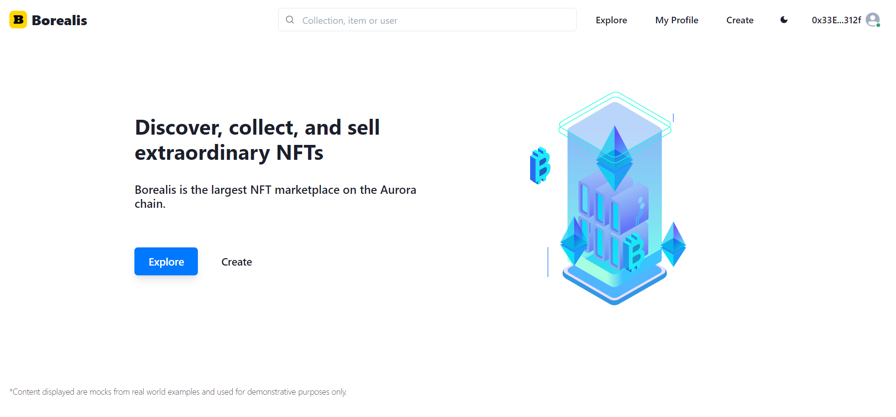
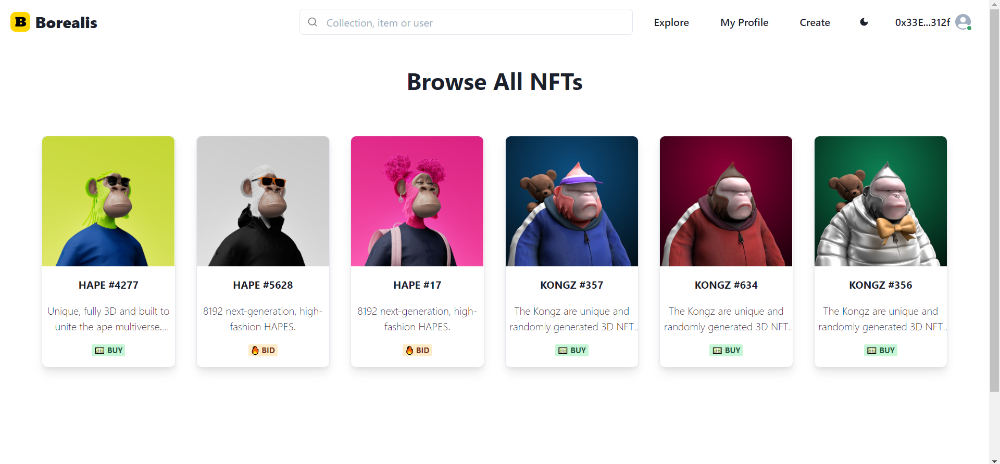
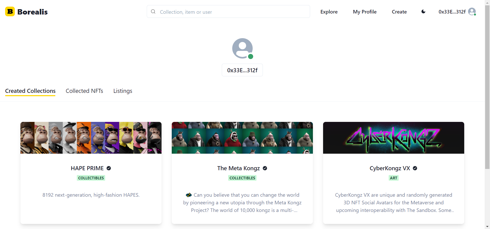
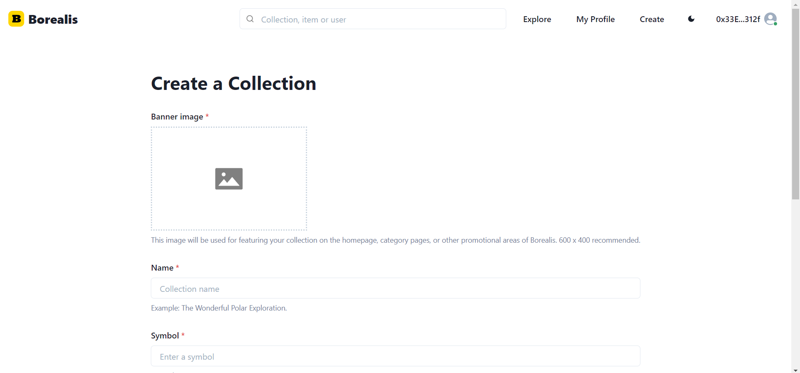
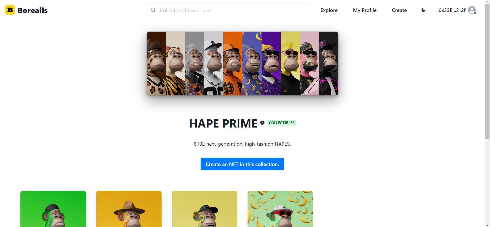
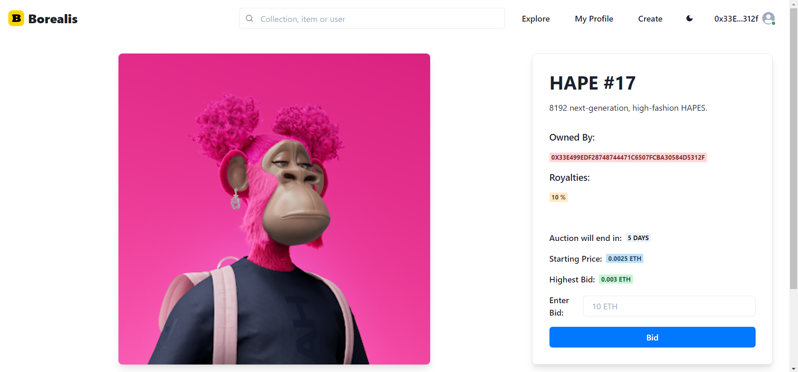

# Borealis

## Overview

Borealis is a NFT marketplace on Aurora chain. It facilitates the creating, buying and selling of NFTs in an automated environment.

- [Demo Website](https://borealis-nft-marketplace.vercel.app/)
- [Demo Video](https://www.youtube.com/watch?v=_hDyWQ7tpT8)

## Contracts

- CollectionFactory - 0xb3507D0FeF19a317d5ab10550Df66BD307C1b3A8
- NFT Market - 0x5f6b7109C6132023F05a8a60824b4541a532BDD1
- CollectionFactory OLD - 0x64964989E33617cBD2a2E9Db48fB5049b76820Af
- NFT Market OLD - 0x5f0480244EdfEf51A9c8aDb4da80bE9cBD960f7b

## Features

1. Create a collection of NFTs straight from Borealis Collection Factory.
2. Mint unlimited NFTs under your collections.
3. Put up your newly created NFTs for sale, with either a **Fixed** or **Auction** sales type.
4. Check out the marketplace where other users list their NFTs for sale.
5. Purchase or bid on NFTs that you like.
6. Original creators receive customizable royalties from every sale and resale of their NFTs.

## Screenshots

- **Home Page**
  
- **NFT Market Place**
  
- **My Profile**
  
- **Create Collection**
  
- **Collection Details**
  
- **NFT Details**
  

## What's Next For Borealis

- Partnerships with artists
- Speeding up NFT uploads and retrieval
- Automated verification process of collections and NFTs
- Analysis such as historical sales prices, bidding
- Crosschain capablilities
